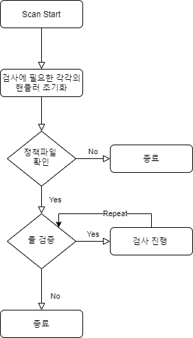
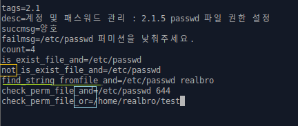
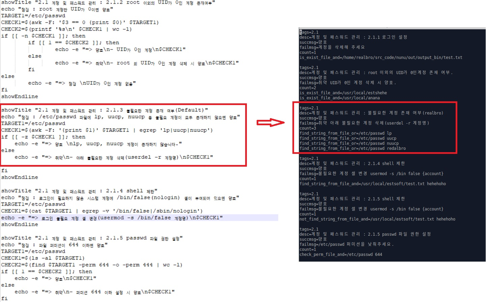

# 취약점 탐지 방법 프로토타입
## 환경
- c++11/14 , uBuntu 18.04, clion

## 개발 방향
1. **최대한 script 느낌의 프로그램을 작성하는 방향을 지향 (개발,운영을 분리시키는 이점을 누리는것이 목표)**
2. ISMS나 보편적인 취약점 스크립트의 기능 모두 구현 가능할것
3. script 작성이 편리할것 
4. 컴팩트한 메모리 사용과 성능을 보여줄것
5. 하위 OS 호환

## 간단하게 표현한 Flow Chart


## 구현
* 코드를 기반으로 별도의 설명을 하도록 하겠습니다.

## (현) 방식의 장점 및 Risk
### 장점
1. 리눅스 환경의 /bin, /sbin 내부의 바이너리들 부터 자유롭다.
2. 프로그램이기 때문에  각종 shell (배쉬, 콘, 기타 등등), shell-built-in 명령어 등에 자유롭다.
3. os 버전에 따라 변경된 바이너리 사용법등이 상당수 존재하는데 이에 따라 자유롭다. (예, cent6과 7에 존재하는 ifconfig의 인터페이스와 버전이 다르다)
4. nana gui를 제외한 대부분의 평범한 c api (system api)를 기반으로 작성가능하므로 하위 os (4.0)지원이 가능하다.

### Risk
1. Linux OS 특성상 너무나 다양한 프로그램들이 존재하여 테스트 어려움이 존재
2. 원터치(원클릭) 처리의 어려움 (리스크가 매우높음)

## 스크립트 
### Sampling
1. {action_name=param} , 예) is_exist_file=/etc/passwd (=> /etc/passwd 파일이 존재한다면 TRUE가 반환)
2. {<span style="color:#e11d21">**not_**</span>action_name=param}   not 연산 is_exist_file=/etc/passwd (=> /etc/passwd 파일이 존재한다면 <span style="color:#e11d21">!TRUE = FALSE</span>가 반환)
3. {action_name<span style="color:#e11d21">**_and(or)**</span>=param} , 예) and 연산으로서 true가 아닐경우 다음 조건을 진행하지 아니함 
- 동작 설명
```
not_is_exist_file_and=/home/test2 
is_exist_file_and=/home/test
find_string_from_file_and=/home/test finditem
```
=> home/test2가 없고(and), home/test가 존재하며(and), home/test 파일내 finditem이라는 내용이 있다면
TRUE 조건 발생후 failmsg 출력됨


### 변환 예시


## ProtoType 시연
### CUI

